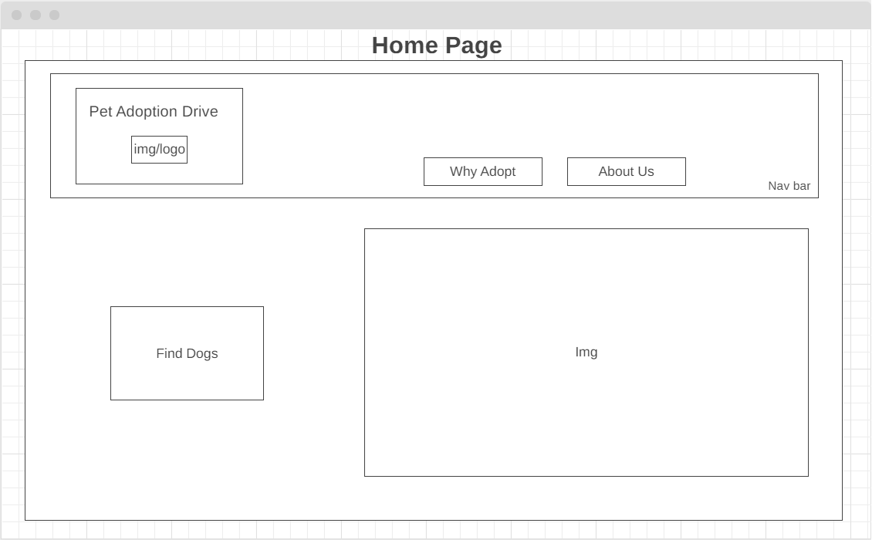
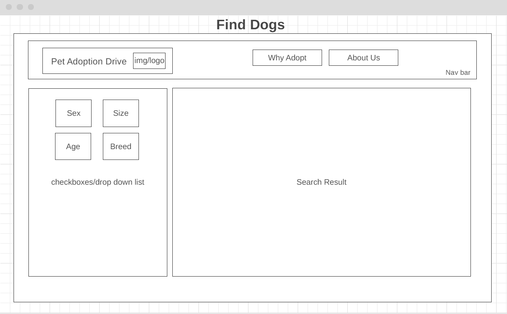

# Pet Adoption Drive

A simple website to find dogs available for adoption. It has a wide selection of dogs all over US with detailed information about the pets such as age/breed/activity levels/coatlength and their specific needs.


## Description

I would like to create an interactive app that would be simple to use, and easy to navigate. It is targeted for anyone who is keen on adopting a dog and provide a new loving home for these cute animals. We have a wide selection of dogs who deserve a second chance, spreading across the US states. 


## Technology Used

Technology used to build this project.

- Javascript
- HTML
- ReactJS
- React Router
- CSS
- Material UI
- APIs: https://api.rescuegroups.org/v5/public/docs


## Wireframe




## User Interface/Instructions

```
An engaging and simple UI to facilitate the adoption process
Checkboxes
```


## Planning and Development Process
Nesting different components together 


## Problems
Most of the problems faced were related to the API call, as the data returned were disorganised and some of the values were left blank. This created problems as I coded for each individually returned pet. 


## Unsolved Problems
I was not able to do the checkbox and result to be instantly projected on the same page. The struggle was to filter the returned data. 

## APIs Used
https://api.rescuegroups.org/v5/public/docs


## Acknowledgments
Special Thanks to RescueGroups.org for providing access to their data and being the fundamental cornerstone of this project.


